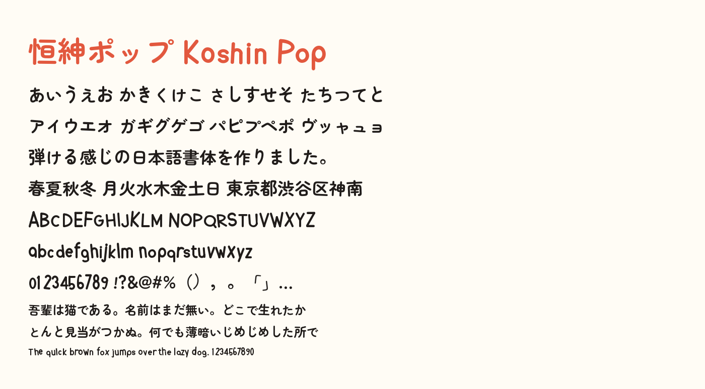

# 恒紳ポップ / Koshin Pop

文字ごとに跳ね方・傾き・大きさが変わる、**弾ける日本語書体**です。
欧文・仮名・漢字（JIS 第一水準・第二水準）を収録し、Regular / Bold / Black の 3 ウェイトを用意しています。



## 特徴

**跳ねる。** 一文字ずつ上下にずらし、傾け、大きさを変えています。振れ幅は文字ごとに固定なので、
組んだときのリズムは常に同じ。日本語のリズムを作るのは仮名なので、仮名を大きく、
画数が多く可読性への負荷が大きい漢字は控えめに、単独で並ぶことが多い欧文はいちばん大きく振っています。

**跳ねたら伸びる。** 上に跳ねた字は縦に伸び、沈んだ字は横に潰れます（スクワッシュ＆ストレッチ）。
弾むボールと同じ動きで、単なるランダムな上下動が「弾んでいる」動きに見えます。

**同じ字が並んでも形が変わる。** 「ああああ」「LOOOOK」のように同じ文字が続いても、
隣り合った字が同じ形になりません。OpenType の `calt` で基本形 → pop1 → pop2 → 基本形と循環させています。
`ss01` / `ss02` で特定の跳ね方に固定することもできます。

**欧文は独自設計。** A–Z / a–z / 0–9 は骨格から描き起こした単線ジオメトリックの字形です。
`a` と `g` は 1 階建てにして、幾何学的でポップな性格を出しています。

## 使う

`build/` にビルド済みのフォントが入っています。

| ファイル | 用途 |
| --- | --- |
| `build/KoshinPop-{Regular,Bold,Black}.ttf` | OS へのインストール、デザインツール |
| `build/KoshinPop-{Regular,Bold,Black}.woff2` | Web |

```css
@font-face {
  font-family: "Koshin Pop";
  src: url("KoshinPop-Bold.woff2") format("woff2");
  font-weight: 700;
  font-display: swap;
}

.headline {
  font-family: "Koshin Pop", sans-serif;
  font-weight: 700;
}

/* 跳ね方の変化を止めたいとき */
.static { font-feature-settings: "calt" 0; }

/* 跳ね方を固定したいとき */
.variant-1 { font-feature-settings: "calt" 0, "ss01"; }
```

見本帳は `docs/specimen.html` をブラウザで開いてください。試し打ち欄もあります。

## ビルドする

```bash
pip install -r requirements.txt
python3 tools/fetch_sources.py   # ベースフォントの取得（初回のみ）
python3 tools/build.py           # build/ に TTF と WOFF2 を出力
python3 tools/check.py           # 検証
```

特定のウェイトだけビルドする場合は `python3 tools/build.py Bold` のように指定します。

### 構成

| ファイル | 役割 |
| --- | --- |
| `tools/fetch_sources.py` | ベースフォントの取得 |
| `tools/strokes.py` | 骨格線に丸い線幅を与えてアウトラインを作る幾何ライブラリ |
| `tools/latin.py` | オリジナル欧文（A–Z / a–z / 0–9）の骨格定義 |
| `tools/latin_swap.py` | 欧文グリフの差し替え |
| `tools/bounce.py` | 「弾ける」変形エンジン |
| `tools/variants.py` | 異体字の生成と `calt` / `ss01` / `ss02` |
| `tools/naming.py` | 書体名・メトリクス・ライセンス情報 |
| `tools/build.py` | ビルド全体の進行 |
| `tools/check.py` | ビルド結果の検証 |
| `tools/proof.py` | 見本画像の書き出し |

### 調整したいとき

- **跳ね方の強さ** — `tools/bounce.py` の `DEFAULT_MOTION`。字種ごとに
  `rise`（跳ね上げ）・`tilt`（傾き）・`pop`（大小）・`squash`（縦横比）を持ちます。
- **欧文の字形** — `tools/latin.py`。各文字が骨格線のリストを返すだけなので、座標を変えれば形が変わります。
- **欧文の太さ** — `tools/latin_swap.py` の `STEM_BY_STYLE`。
- **書体名・デザイナー名** — `tools/naming.py` の先頭の定数。

変形は文字ごとに決定的（グリフ名から算出）なので、何度ビルドしても同じフォントができます。

## ライセンス

SIL Open Font License 1.1（[LICENSE](LICENSE)）。

仮名・漢字のアウトラインは [Zen Maru Gothic](https://github.com/googlefonts/zen-marugothic)
（Copyright 2021 The Zen Maru Gothic Authors、OFL 1.1）に由来する派生フォントです。
欧文の字形、変形の設計、異体字の仕組みは本リポジトリで作成しています。
